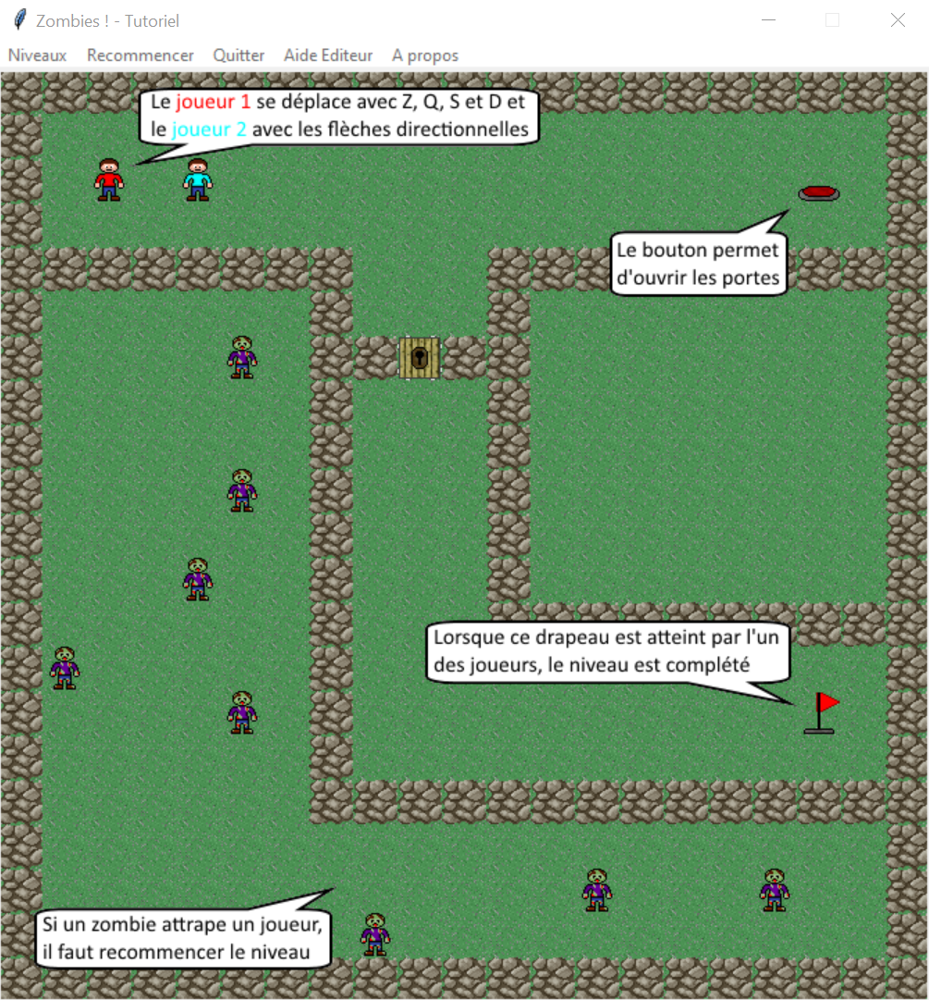

# Jeux de zombie 🧠

Projet fait en 2015 en projet final d'ISN.
Il est développer en Python 🐍 avec le framework Tkinter. 

Nous avons décidé de développer un jeu de réfléxion en coopération.

***
## Règles du projet :

- language : `python`
- framework : `tkinter`

***

## Comment lancer le projet

Prérequis : intaller `Python 3` sur votre machine

- Cloner le projet : `git clone https://github.com/Raphi-Sch/Zombie.git`
- Se placer dans le projet via un cmd
- lancer le projet avec `python Principal.py`
