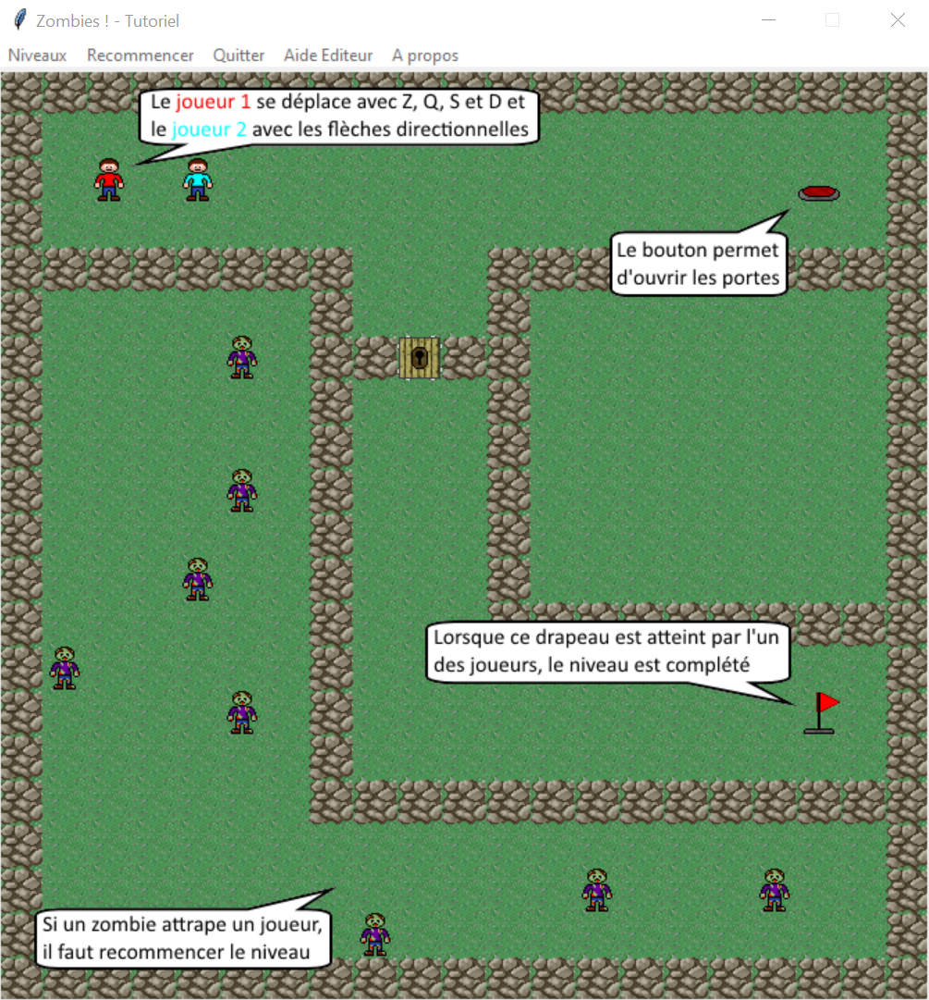

# Zombie game 🧠

Project made during high school in 2015.
It is made in Python 🐍 with the Tkinter framework 

***
The goal was to develop any application with tkinter.

We choose to develop a two player coop puzzle game.

the game has only a French tutorial

***
## Rules of the project:

- authorized language: `python`
- authorized framework: `tkinter`

***

## How to run the project

Prerequisite : intall `Python 3` in your computer

- Clone the project : `git clone https://github.com/Raphi-Sch/Zombie.git`
- Go into the project with a cmd
- run the project with `python Principal.py`
